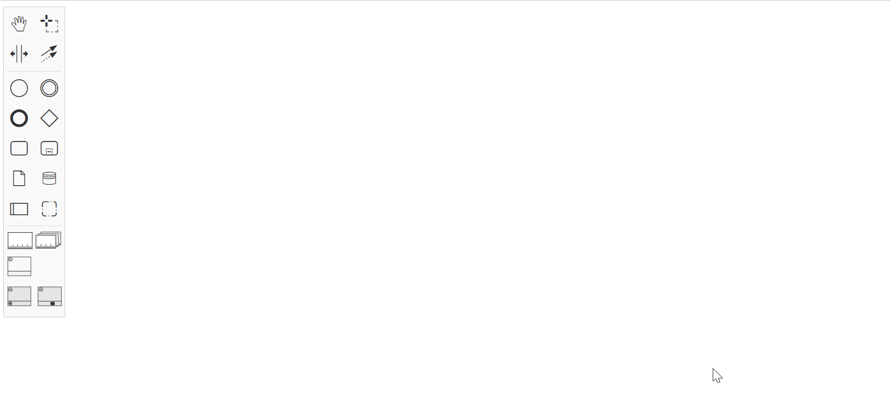

# ***VISUAL PPINOT***

### About
VISUAL PPINOT is a graphical notation for defining PPIs together with business process models.  Its underlying formal metamodel allows the automated processing of PPIs. Furthermore, it improves current state-of-the-art proposals in terms of expressiveness and in terms of providing an explicit visualisation of the link between PPIs and business processes, which avoids inconsistencies and promotes their co-evolution. VISUAL PPINOT can be integrated with Business Process Model Notation (BPMN). If you want to know more information about VISUAL PPINOT, click on this link https://link.springer.com/article/10.1007/s12599-017-0483-3.

In this repository, BPMN io (https://github.com/bpmn-io) has been extended to implement VISUAL PPINOT.

<p align="center">
  
</p>

### Building
To use this editor, you must follow these steps:
1. Install Visual Studio Code first (https://code.visualstudio.com/)
2. Download NodeJS (https://nodejs.org/es/)
3. Download this project 
4. Execute in a Visual Studio Code console the following command to install all required project dependencies:
```text
npm install
```
5. Execute in a Visual Studio Code console the following command to spin up the test interactively in the browser:
```text
npm run dev
```
6. Then a tab will open in your browser with the editor, but in case it doesn't open, visit http://localhost:9000/


### How to extend VISUAL PPINOT:
If you want to extend VISUAL PPINOT, you will have to modify some files depending on what you want to change (in each section there is an explained example):

New icons:
  - index.html: if you want to add new icons to the editor, you will have to code a svg image to ready for css using this conversor https://yoksel.github.io/url-encoder/
  - PPINOTPalette.js: if you want to add these icons to the palette you will have to assing new icons to the editor palette, you will to assign the icons of the index.html to a certain object.

New shapes: 
  - Folder svg, file index.js: you must convert your svg images in a base 64 format to be represented in the diagram. 
  - PPINOTRender.js: sets what shapes will be created on the diagram when an element is dragged from the palette. 
  - PPINOTElementFactory.js: you can define the dimensions and properties of your new elements.

Buttons in sub palette of an object:
  - PPINOTContextPadProvider.js: if you want to modify or add an icon to the sub palette of an object, you will to have to add it here. These buttons could be for elements and connectors.

Connections:
  - Types.js: you include your connectors in some groups belonging to this file to classify these connections and limit theis connectivity. 
  - PPINOTRender.js: sets the shape of the connector.
  - PPINOTRules.js: here you define the rules of connection for the different types of connectors and elements created. 
  - PPINOTConnect.js: this is useful if you want to create a connection that includes an element or a more complex connection.

Replace elements: 
  - PPINOTReplaceOptions.js: sets the options to replace an element by other, that appear in the popup menu.
  - PPINOTReplaceMenuProvider.js: sets the replacement logic and defines the buttons to make the replacement.

Labels: 
  - PPINOTLabelEditingProvider.js: it regulates the box and the default content of the labels.
  - PPINOTRender.js: there are som functions to render label within elements.
  - Types.js: here it is also defined that connectors and elements have a label.

