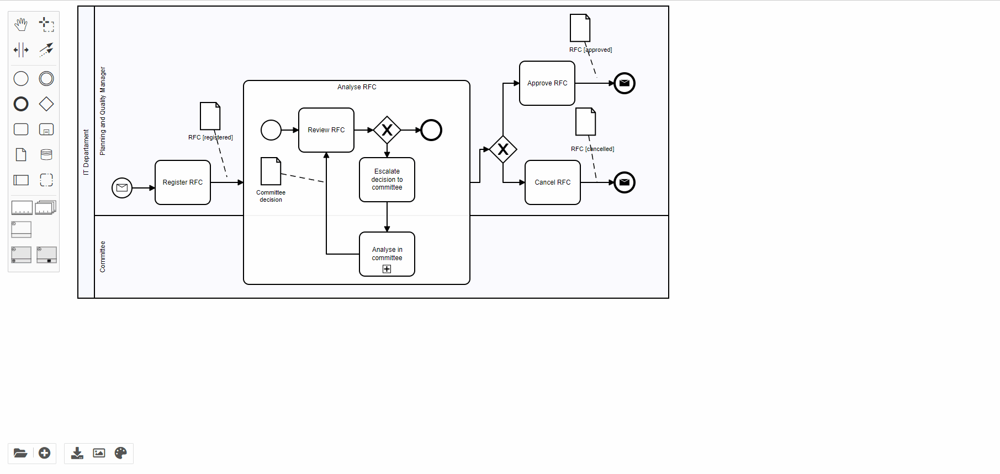

# ***VISUAL PPINOT***

### About
VISUAL PPINOT is a graphical notation for defining PPIs together with business process models.  Its underlying formal metamodel allows the automated processing of PPIs. Furthermore, it improves current state-of-the-art proposals in terms of expressiveness and in terms of providing an explicit visualisation of the link between PPIs and business processes, which avoids inconsistencies and promotes their co-evolution. VISUAL PPINOT can be integrated with Business Process Model Notation (BPMN). If you want to know more information about VISUAL PPINOT, click on this link https://link.springer.com/article/10.1007/s12599-017-0483-3.

In this repository, BPMN io (https://github.com/bpmn-io) has been extended to implement VISUAL PPINOT.

[Try out the editor](public/)

  

